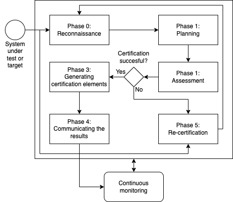

# Abstract
The main result of Task 3.8 - Conformity, Validation and Certification is SURFACE (Support Framework for Certification) – an integrated approach that can be used to support certification and recertification.

# SURFACE – a Support Framework for Certification
We present SURFACE – a support framework for certification which integrates and combines steps and processes from the ARMOUR methodology, the ECSO meta-scheme, the European Cybersecurity Candidate Scheme and the continuous monitoring process from NIST 800-137. The process in SURFACE is divided into phases inspired by the ARMOUR methodology.

We found that each of the solutions is missing some processes. The ECSO meta-scheme approach is more general than the ARMOUR methodology and allows the certification of different products and services (not only IoT devices). However, it lacks processes for recertification or continuous monitoring. Another drawback of the meta-scheme approach is that there is no common platform or database to share the findings and results. Combining solutions from different approaches can help in creating a solution that deals with the shortcomings.

SURFACE defines the security assessments as processes that are carried out by a conformity assessment body or an accredited third-party. For risk assessment, SURFACE uses semi-quantitative risk assessment. To support risk communication, the generated risk scores (quantitative) can be mapped to the severity levels (qualitative).

SURFACE represents the certification in a structured manner. This introduces a layer of transparency to the certification process and results, simplifies automatic analysis and allows for a more reliable communication of discovered vulnerabilities and affected certificates. The framework uses a cybersecurity label similar to the ARMOUR methodology. This helps to represent the certified product as well as the security level of the security properties.

SURFACE also supports the recertification of subcomponents to reduce the time and cost of this process.

## SURFACE workflow

The certification and recertification process of SURFACE is described on a high level in the figure below. The processes are divided into phases inspired by the ARMOUR methodology:

* Phase 0 (reconnaissance) where we identify the scope and select the appropriate certification schemes;
* Phase 1 (planning), where we establish the context, develop a Generalised Protection Profile and plan the security control assessment process;
* Phase 2 (assessment), where we carry out the security testing and risk assessment;
* Phase 3 (generating certification elements), where we generate the certificate and the accompanying materials;
* Phase 4 (communicating the results), where we share the certification elements with experts and clients;
* Phase 5 (recertification), where we decide whether to recertify the whole target or components; and finally,
* the continuous monitoring process.

## Certification Assistant Tool CSA
CSA is a web-based asset management and certification assistant tool. The certification workflow has been built based on SURFACE. The certification dimension adds another layer to asset management. It allows the manufacturer or vendor to carry out incremental certification based on sub-assets.

# Recources
* Jaskolka J., Jawad A., Samuel J., Hamid, B. (2021) A Security Property Decomposition Argument Pattern for Structured Assurance Case Models. In: 26th European Conference on Pattern Languages of Programs (EuroPLoP'21). Article 24, 1–10. Association for Computing Machinery, New York, NY, USA, https://doi.org/10.1145/3489449.3490001
* Quentin Rouland, Brahim Hamid, and Jason Jaskolka. Specification, detection, and treatment of stride threats for software components: Modeling, formal methods, and tool support. Journal of Systems Architecture, 117:102073, 2021, https://doi.org/10.1016/j.sysarc.2021.102073
* Quentin Rouland, Brahim Hamid, Jason Jaskolka: Formal specification and verification of reusable communication models for distributed systems architecture. Future Gener. Comput. Syst. 108: 178-197 (2020), https://doi.org/10.1016/j.future.2020.02.033

# Cybersecurity Research and Areas Priority
--- | Governance and Capacity Building | Trustworthy Ecosystems of Systems | Trust-Building Blocks | Disruptive Emerging Development
--- | --- | --- | --- | ---
CSA  | :heavy_check_mark: | :heavy_check_mark: | :heavy_check_mark: | - 

--- | Collaborative Networks| Education & Training | Certification | Secure Platforms of Platforms | Infrastructure Protection | Holistic Data Protection | AI-based Security | Systems Security & Security Lifetime Management | Secure Architectures for Next Generation Communication | Secure Quantum Technologies | Secure AI Systems | Personalized Privacy Protection
--- | --- | --- | ---  | --- | --- | --- | --- | --- | --- | --- | --- | --- 
CSA  |  ---  | --- | :heavy_check_mark: | --- | :heavy_check_mark: | --- | --- | :heavy_check_mark: | --- | --- | --- | ---
